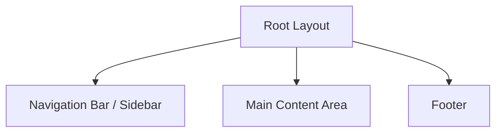

# Layout Design Architecture

This document defines the structural layout and component hierarchy for the Next.js migration. It ensures a consistent user experience while leveraging modern web design patterns like responsive grids and sticky navigations.

## 1. Global Layout (Root)
The `layout.tsx` file in Next.js will wrap all pages.

### Components:
- **Navigation (Left Sidebar or Top Bar)**:
    - Logo / Title
    - Links: Dashboard, Insights, Simulations, Science, AI Assistant
    - Data Refresh Status Indicator (Staleness Banner logic)
- **Main Content**:
    - Central area with max-width container (e.g., `max-w-7xl`).
    - Standardized `padding` (e.g., `p-4` to `p-8`).

## 2. Dashboard Layout (Grid System)
The main dashboard should follow a 12-column grid system for responsiveness.

| Section | Grid Span (Desktop) | Component Style |
| :--- | :--- | :--- |
| **AQI Summary Cards** | `4 columns each` (3 per row) | Small Cards |
| **Primary Chart** | `12 columns` | Large Card with Plotly |
| **Secondary Charts** | `6 columns each` (2 per row) | Half-width Cards |
| **Data Table** | `12 columns` | Full-width Card |

## 3. Interactive Analysis Layouts
For "Model Insights" and "What-If" pages:

- **Config Header**: A sticky horizontal bar containing Region selection and Time range toggles.
- **Side-by-Side View**: 
    - **Left**: Visualization (Waterfall chart / Scenario Bar).
    - **Right**: Explanation markdown or Detail Table.

## 4. Chat Interface Layout (AI Assistant)
Specific layout for the Dual-Agent chat:

- **Split View (Optional)**: If the user wants to see both agents simultaneously.
- **Focus View (Current)**:
    - **Top**: Agent selection tabs (Vayu / DELPHI).
    - **Middle**: Scrollable message area with distinct avatar/styling for each agent.
    - **Bottom**: Floating chat input bar with "Suggestion Chips" above it.

## 5. Visual Hierarchy
1. **Primary Information**: Central AQI value and Category (high contrast).
2. **Supporting Data**: Trend charts and tables (medium focus).
3. **Contextual Info**: SHAP values and fine-grained feature impacts (collapsible expanders).

## 6. Responsive Behavior
- **Mobile**: Single column stack for all cards/charts. Navigation moves to a hamburger menu.
- **Tablet**: 2-column grid for summary cards; full width for charts.
- **Desktop**: 3-column grid for summary cards; specialized layouts as described above.
